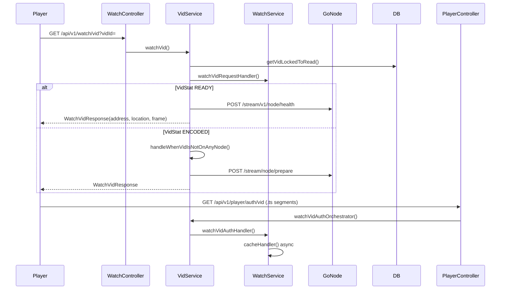
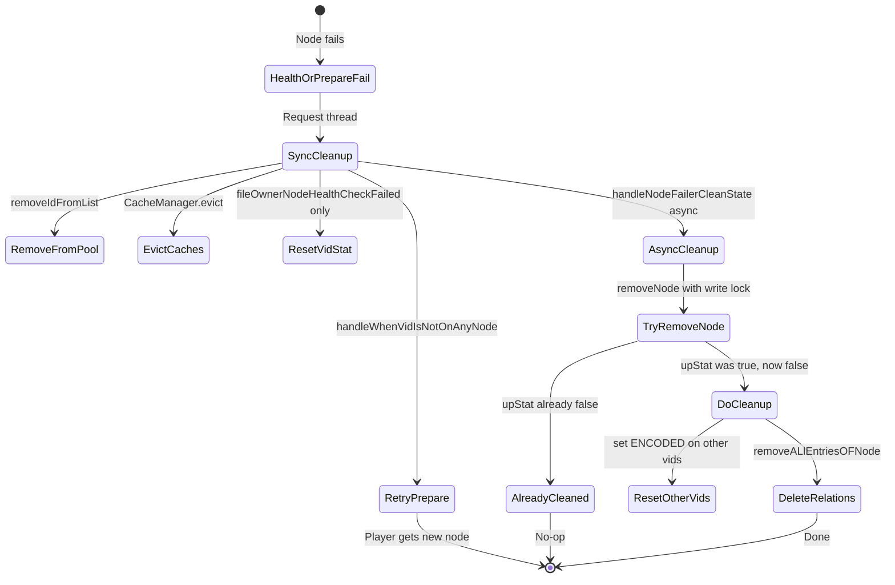
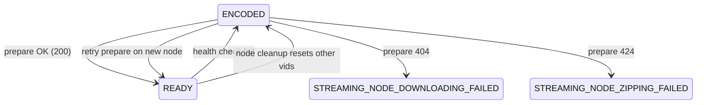
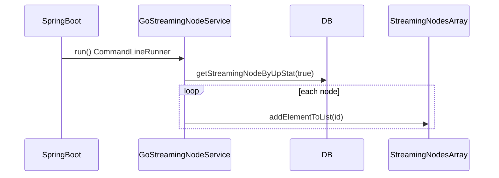
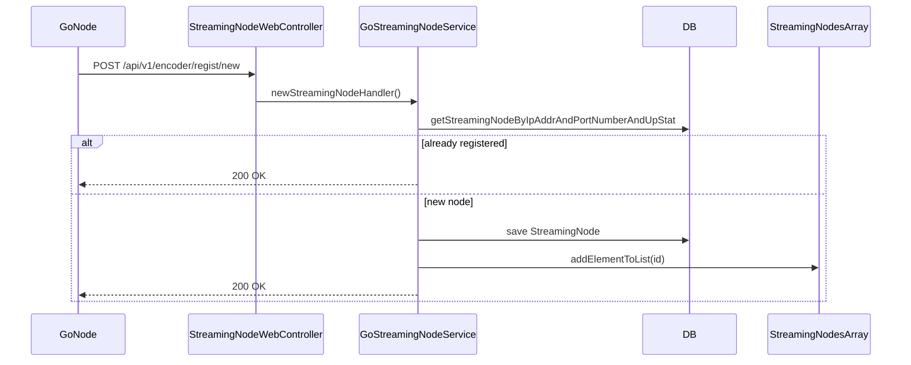

# VidService Streaming Architecture

Developer reference for the Spring API video streaming orchestration layer. This document covers how a player request flows from the browser through `VidService`, how streaming nodes are selected and health-checked, caching and DB optimizations, concurrency controls, failure cleanup, inline heal-up, and node registration.

For encoding and upload flows, see [Encoding.md](./Encoding.md). For rough early notes, see [full vid req cycle.md](./full%20vid%20req%20cycle.md).

---

## Table of Contents

1. [End-to-End Player Request Flow](#1-end-to-end-player-request-flow)
2. [Node Selection](#2-node-selection)
3. [Health Checks and Decisions](#3-health-checks-and-decisions)
4. [Caches and DB Optimization](#4-caches-and-db-optimization)
5. [Method Index](#5-method-index)
6. [Concurrency: Pessimistic Read/Write Locks](#6-concurrency-pessimistic-readwrite-locks)
7. [Cleanup on Node Failure](#7-cleanup-on-node-failure)
8. [Dynamic Heal-Up](#8-dynamic-heal-up)
9. [Node Registration (Startup + Runtime)](#9-node-registration-startup--runtime)
10. [Known Quirks and Implementation Notes](#10-known-quirks-and-implementation-notes)
11. [Glossary](#11-glossary)
12. [Related Files](#12-related-files)

---

## 1. End-to-End Player Request Flow

The streaming lifecycle has two authenticated HTTP entry points: one to **route the player to a Go streaming node**, and one to **authorize HLS segment requests** as the player fetches `.ts` files.

### 1.1 Initial Watch / Routing

| Item | Value |
|------|-------|
| Endpoint | `GET /api/v1/watch/vid?vidId={uuid}` |
| Controller | `WatchController.watchHandler` |
| Service entry | `VidService.watchVid` |
| Auth | `@PreAuthorize("ACTIVE")` — JWT required |

**Step-by-step:**

1. **`WatchController.watchHandler`** builds a `WatchVIdRequest` from the `vidId` query param and delegates to `VidService.watchVid`.
2. **`VidService.watchVid`** (annotated `@Transactional`):
   - Parses `userId` from `UserDetails.getUsername()`.
   - Loads the vid under a pessimistic read lock: `VidRepo.getVidLockedToRead(vidId)`.
   - Throws `ResourceNotFoundException` if the vid does not exist.
   - Calls **`WatchService.watchVidRequestHandler(vidId, userId)`** to create or load watch history and return the resume frame.
   - Branches on `VidStat`:
     - **`READY`** → `handelIfVidIsOnNode(vid, userDetails, currentFrame)` — vid is already prepared on a node; health-check that node.
     - **Otherwise (typically `ENCODED`)** → `handleWhenVidIsNotOnAnyNode(vid, userDetails, currentFrame)` — pick a node and call prepare.
3. Returns **`WatchVidResponse`**: `{ address, vidLocation, currentFrame }`.
   - `address` — Go node endpoint (`ip:port`) the player should use for HLS.
   - `vidLocation` — `Vid.encodedLocation` (S3/object key path used by the Go node).
   - `currentFrame` — resume position from watch history.

### 1.2 Segment Auth (HLS `.ts` via nginx `auth_request`)

| Item | Value |
|------|-------|
| Endpoint | `GET /api/v1/player/auth/vid` |
| Controller | `PlayerController.authVidRequest` |
| Service entry | `VidService.watchVidAuthOrchestrator` |
| Auth | `@PreAuthorize("ACTIVE")` |

Nginx forwards these headers on each segment request:

- `request-uri` — path being fetched (e.g. `/get/vid/get/{vidLoc}/{quality}/{segmentNumber}.ts`)
- `current-frame` — player's current playback position
- `Authorization` — JWT

**Step-by-step:**

1. **`PlayerController.authVidRequest`** logs headers and calls `VidService.watchVidAuthOrchestrator`.
2. **`VidService.watchVidAuthOrchestrator`**:
   - Parses `current-frame` from the request header.
   - If the URI **does not** end with `.ts` (master playlist, variant playlist, etc.) → returns `200 OK` immediately with no further processing.
   - If the URI **ends with `.ts`**:
     - Splits URI: `/get/vid/get/{vidLoc}/{quality}/{segmentNumber}` (index 3 = vid location, index 5 = segment).
     - Resolves vid location → vid ID via **`VidServiceUtil.getCatchableVidIDFromVidLocation(vidLocation)`** (Spring cache).
     - Builds `GetVidHeader(vidId, currentFrame)` and delegates to **`WatchService.watchVidAuthHandler`**.
3. **`WatchService.watchVidAuthHandler`** calls **`WatchService.cacheHandler`** (`@Async`) to update the in-memory Caffeine frame cache, then returns `200 OK`.

A `200` from this endpoint allows nginx to serve the segment; any error blocks it.

### 1.3 Watch History and Frame Tracking

**`WatchService.watchVidRequestHandler(vidId, userId)`** (called during initial watch):

- If no `Watch` row exists for this user+vid → creates one with `currentFrame = 0.0`, saves, returns `0.0`.
- If a row exists:
  - If the Caffeine frame cache has an entry for `vidId` → returns cached frame (most recent segment auth update).
  - Otherwise → returns `Watch.currentFrame` from DB.

**`WatchService.cacheHandler(vidId, currentFrame)`** (`@Async`):

- Puts `{ vidId → currentFrame }` into the Caffeine bean from `CashConfig.getCurrentVidLocationCache`.
- On **30s expiry**, the removal listener persists the frame to the `Watch` table.

### 1.4 Catalog Endpoint (Secondary)

| Item | Value |
|------|-------|
| Endpoint | `GET /api/v1/watch/page` |
| Controller | `WatchController.loadPage` |
| Service | `VidService.getAvailableVidPageHandler` |

Returns all vids with `VidStat.ENCODED` or `VidStat.READY` as a list of `{ id, name }` for the watch page UI.

### 1.5 Full Lifecycle Sequence Diagram



---

## 2. Node Selection

Node selection is handled by **`GoStreamingNodeService`** backed by an in-memory pool in **`StreamingNodesArray`**.

### 2.1 In-Memory Node Pool

**`StreamingNodesArray`** wraps a `CopyOnWriteArrayList<UUID>`:

| Method | Purpose |
|--------|---------|
| `addElementToList(UUID)` | Add node ID to pool |
| `getElementAtIndex(int)` | Random access for selection |
| `getArraysSize()` | Pool size |
| `removeElement(UUID)` | Remove failed node immediately |

The pool holds **IDs only**. Full `StreamingNode` entities are loaded from DB when needed.

### 2.2 When a Vid Is Already READY

In **`VidService.handelIfVidIsOnNode`**:

1. **`VidStoreService.getNodIdAssociatedWithVidId(vidId)`** — cached lookup of which node owns this vid.
2. **`GoStreamingNodeService.getStreamingNodeWithReadLock(nodeId)`** — load node entity and check `upStat`.
3. **`GoStreamingNodeService.getIpAndPortAddr(nodeId)`** — resolve `ip:port` (cached).
4. Health check is performed against that specific node (see Section 3).

### 2.3 When a Vid Needs Preparation (ENCODED)

In **`VidService.handleWhenVidIsNotOnAnyNode`**:

1. **`GoStreamingNodeService.returnSizeOfTheArray()`** — if `0`, return `503 SERVICE_UNAVAILABLE`.
2. **`GoStreamingNodeService.selectRandomNode()`**:
   - `random.nextInt(streamingNodesArray.getArraysSize())`
   - `streamingNodesArray.getElementAtIndex(index)`
   - `StreamingNodeRepo.getStreamingNodeById(uuid)`
3. **`GoStreamingNodeService.getIpAndPortAddr(selectedNode.getId())`** — build prepare URI.
4. POST prepare request to the chosen node (see Section 8).

### 2.4 Selection Characteristics

- **Uniform random** — no load balancing, no affinity beyond existing `VidStoreLocation` for `READY` vids.
- **Immediate removal on failure** — `removeIdFromList(nodeId)` drops a node from the pool before async cleanup completes, so retries won't pick the same failed node.

---

## 3. Health Checks and Decisions

Health checks run **on demand** when a user watches a vid that is already `READY`. There is no scheduled background health poller.

**Entry method:** `VidService.handelIfVidIsOnNode`

### 3.1 Pre-Health Checks

1. Resolve node: `VidStoreService.getNodIdAssociatedWithVidId(vid.getId())`.
2. Load node: `GoStreamingNodeService.getStreamingNodeWithReadLock(nodeId)`.
3. If **`!streamingNode.isUpStat()`** → recursive call to **`watchVid(new WatchVIdRequest(vid.getId()), userDetails)`** to fail over without hitting the health endpoint.

### 3.2 Health HTTP Call

Two URIs are built; **only the local dev URI is used in current code**:

| URI | Pattern | Used? |
|-----|---------|-------|
| Prod | `{ip}:{port}/stream/v1/node/health` | Built via `getIpAndPortAddr` but **not called** |
| Dev | `http://host.docker.internal:{port}/stream/v1/node/health` | **Active** — hardcoded for Docker local dev |

```java
// VidService.handelIfVidIsOnNode — dev URI is what RestClient actually calls
String uriLocalDev = "http://host.docker.internal:"
    + goStreamingNodeService.getPortAddr(nodeId)
    + "/stream/v1/node/health";

restClient.post().uri(uriLocalDev).retrieve().toEntity(String.class);
```

The same dev/prod split applies to the prepare endpoint (Section 8).

### 3.3 Decision Table

| Outcome | Synchronous action | Async action | Return to player |
|---------|-------------------|--------------|------------------|
| HTTP 200 | Log success | — | `WatchVidResponse(nodeEndPoint, encodedLocation, currentFrame)` |
| Non-200 status | `fileOwnerNodeHealthCheckFailed` | `handleNodeFailerCleanState(nodeId, vidId)` | Result of re-routed prepare on another node |
| Exception (connection refused, timeout, etc.) | Same as non-200 | Same | Same |

**`fileOwnerNodeHealthCheckFailed`** does:

1. `vid.setVidStat(VidStat.ENCODED)` — mark vid as no longer ready on that node.
2. `goStreamingNodeService.removeIdFromList(streamingNodeId)` — drop from pool.
3. Evict caches: `vid_id_to_node`, `nod_id_to_addr`, `node_id_to_port_addr`.
4. Call **`handleWhenVidIsNotOnAnyNode`** — pick another node and prepare.

---

## 4. Caches and DB Optimization

### 4.1 Spring Caffeine Caches (60-minute TTL)

Configured in `application-dev.yaml` under `spring.cache.cache-names` with `expireAfterWrite=60m`.

| Cache name | Key | Value | Populated by | Evicted on failure |
|------------|-----|-------|--------------|-------------------|
| `vid_id` | `vidLoc` (encoded location string) | `vidId` (UUID) | `VidServiceUtil.getCatchableVidIDFromVidLocation` | Never (location mapping is stable) |
| `vid_id_to_node` | `vidId` | `nodeId` | `VidStoreService.getNodIdAssociatedWithVidId` | `fileOwnerNodeHealthCheckFailed` |
| `nod_id_to_addr` | `nodeId` | `ip:port` string | `GoStreamingNodeService.getIpAndPortAddr` | Health/prepare failure paths |
| `node_id_to_port_addr` | `nodeId` | port number string | `GoStreamingNodeService.getPortAddr` | Health/prepare failure paths |

All `@Cacheable` methods log a diagnostic message when the cache miss path runs — if you see repeated log lines, the cache is not hitting.

**Manual eviction** uses `CacheManager.getCache(name).evict(key)` in `VidService` failure handlers.

### 4.2 Frame Tracking Cache (Separate Caffeine Bean)

**`CashConfig.getCurrentVidLocationCache`** — `Cache<UUID, Double>`:

- TTL: **30 seconds** (`expireAfterWrite`)
- Written by: `WatchService.cacheHandler` (async, on each `.ts` auth request)
- Read by: `WatchService.watchVidRequestHandler` (on subsequent watch requests within 30s)
- On **EXPIRE**: `CashConfig.removeListener` persists `currentFrame` to the `Watch` table via `WatchRepo.findByVidId` + save

This avoids a DB write on every segment request while still persisting resume position.

### 4.3 DB Query Optimizations

| Technique | Where | Why |
|-----------|-------|-----|
| Pessimistic read lock | `VidRepo.getVidLockedToRead` | Serialize concurrent watch entry on same vid without full table lock |
| Pessimistic write lock | `VidRepo.getVidLockedToWrite` | Exclusive prepare path — prevents double-prepare race |
| Pessimistic write lock | `StreamingNodeRepo.getStreamingNodeByIdForLockedWrite` | Exclusive node state change during cleanup |
| Bulk delete | `VidStoreRepo.deleteVidStoreLocationByStreamingNodeId` | One query to remove all vid↔node relations on failure |
| Targeted queries | `getVidByEncodedLocation`, `getVidStoreLocationByVidId` | Indexed lookups instead of scanning |
| `@Async` relation insert | `VidStoreService.addNewVidToNodeRelation` | Prepare response returned before DB relation row is written |
| `@Version` on `Vid` | `Vid.version` field | Optimistic locking as secondary safety on concurrent entity updates |

---

## 5. Method Index

### 5.1 Controllers

| Class | Method | Endpoint | Delegates to |
|-------|--------|----------|--------------|
| `WatchController` | `watchHandler` | `GET /api/v1/watch/vid` | `VidService.watchVid` |
| `WatchController` | `loadPage` | `GET /api/v1/watch/page` | `VidService.getAvailableVidPageHandler` |
| `PlayerController` | `authVidRequest` | `GET /api/v1/player/auth/vid` | `VidService.watchVidAuthOrchestrator` |
| `StreamingNodeWebController` | `registNewStreamingNodeController` | `POST /api/v1/encoder/regist/new` | `GoStreamingNodeService.newStreamingNodeHandler` |

### 5.2 VidService

| Method | Visibility | Description |
|--------|------------|-------------|
| `watchVid` | public | Main watch entry: lock vid, get frame, branch on `VidStat` |
| `watchVidAuthOrchestrator` | public | Parse segment URI, resolve vid ID, delegate auth |
| `getAvailableVidPageHandler` | public | List `ENCODED` + `READY` vids for watch page |
| `handelIfVidIsOnNode` | private | Health-check owning node for `READY` vids |
| `handleWhenVidIsNotOnAnyNode` | private | Pick random node, POST prepare, set `READY` |
| `fileOwnerNodeHealthCheckFailed` | private | Reset vid to `ENCODED`, evict caches, retry prepare |
| `handelNodeFailerToPrepareFileForStream` | private | Prepare exception path: evict node caches, retry |
| `handleNodeFailerCleanState(UUID, UUID)` | public `@Async` | Full async cleanup; skip resetting current vid stat |
| `handleNodeFailerCleanState(UUID)` | public `@Async` | Full async cleanup; reset all vids on node |

### 5.3 GoStreamingNodeService

| Method | Description |
|--------|-------------|
| `run` | `CommandLineRunner` — hydrate node pool from DB at startup |
| `newStreamingNodeHandler` | Runtime registration from Go nodes |
| `selectRandomNode` | Random pick from in-memory pool |
| `getIpAndPortAddr` | `@Cacheable` — node ID → `ip:port` |
| `getPortAddr` | `@Cacheable` — node ID → port |
| `removeIdFromList` | Remove node ID from in-memory pool (sync) |
| `removeNode` | Pessimistic write lock; set `upStat=false`; idempotent guard |
| `getStreamingNodeWithReadLock` | Load node under write lock (see Section 10) |
| `retrieveAllVidAssociatedWithNode` | Get all `VidStoreLocation` rows for a node |
| `returnSizeOfTheArray` | Current pool size |
| `changeNodeStat` | Set `upStat=false` without lock — **not used by VidService** |

### 5.4 VidStoreService

| Method | Description |
|--------|-------------|
| `getNodIdAssociatedWithVidId` | `@Cacheable` — vid ID → node ID |
| `addNewVidToNodeRelation` | `@Async` — persist `VidStoreLocation` after prepare |
| `removeALlEntriesOFNode` | `@Transactional` — bulk delete relations for failed node |

### 5.5 WatchService

| Method | Description |
|--------|-------------|
| `watchVidRequestHandler` | Create/find watch history; return resume frame |
| `watchVidAuthHandler` | Accept segment auth; trigger frame cache update |
| `cacheHandler` | `@Async` — put frame into Caffeine cache |

### 5.6 VidServiceUtil

| Method | Description |
|--------|-------------|
| `getCatchableVidIDFromVidLocation` | `@Cacheable` — encoded location → vid ID |

### 5.7 Repositories

**VidRepo:**

| Method | Lock |
|--------|------|
| `getVidLockedToRead` | `PESSIMISTIC_READ` |
| `getVidLockedToWrite` | `PESSIMISTIC_WRITE` |
| `getVidByEncodedLocation` | — |
| `getVidIdByEncodedLocation` | — |
| `getVidByVidStatOrVidStat` | — |
| `getVidTOBeEncoded` | — |
| `checkMachineWork` | — |

**StreamingNodeRepo:**

| Method | Lock |
|--------|------|
| `getStreamingNodeByIdForLockedWrite` | `PESSIMISTIC_WRITE` |
| `getStreamingNodeByIpAddrAndPortNumberAndUpStat` | — |
| `getStreamingNodeByUpStat` | — |
| `getStreamingNodeById` | — |
| `getStreamingNodeByIpAddr` | — |

**VidStoreRepo:**

| Method | Description |
|--------|-------------|
| `getVidStoreLocationByVidId` | Lookup vid → node relation |
| `deleteVidStoreLocationByStreamingNodeId` | Bulk cleanup on node failure |

### 5.8 StreamingNodesArray

| Method | Description |
|--------|-------------|
| `addElementToList` | Add node ID |
| `getElementAtIndex` | Get ID at index |
| `getArraysSize` | Pool size |
| `removeElement` | Remove node ID |

### 5.9 DTOs

| Record | Fields |
|--------|--------|
| `WatchVidResponse` | `address`, `vidLocation`, `currentFrame` |
| `WatchVIdRequest` | `vidId` |
| `GetVidHeader` | `vidId`, `currentFrame` |
| `PrepareVidForStreamRequest` | `vid_Id`, `bucket` (call site passes `encodedLocation`, `"encoded"`) |
| `StreamingNodeRegistRequest` | `ip_addr`, `port_number` |

---

## 6. Concurrency: Pessimistic Read/Write Locks

The codebase does **not** use `java.util.concurrent.ReadWriteLock`. Concurrency is handled through **JPA pessimistic locks**, thread-safe collections, transactions, and async execution.

### 6.1 JPA Pessimistic Locks

| Lock mode | Repository method | Called from | Purpose |
|-----------|-------------------|-------------|---------|
| `PESSIMISTIC_READ` | `VidRepo.getVidLockedToRead` | `VidService.watchVid` | Serialize concurrent watch requests on the same vid |
| `PESSIMISTIC_WRITE` | `VidRepo.getVidLockedToWrite` | `VidService.handleWhenVidIsNotOnAnyNode` | Exclusive access during prepare — prevents double-prepare |
| `PESSIMISTIC_WRITE` | `StreamingNodeRepo.getStreamingNodeByIdForLockedWrite` | `GoStreamingNodeService.removeNode`, `getStreamingNodeWithReadLock` | Exclusive node state change during cleanup |

Repository definitions:

```java
// VidRepo.java
@Lock(LockModeType.PESSIMISTIC_READ)
@Query("SELECT v from Vid v WHERE v.id = :uuid")
Optional<Vid> getVidLockedToRead(@Param("uuid") UUID uuid);

@Lock(LockModeType.PESSIMISTIC_WRITE)
@Query("SELECT v from Vid v WHERE v.id = :uuid")
Optional<Vid> getVidLockedToWrite(@Param("uuid") UUID uuid);

// StreamingNodeRepo.java
@Lock(LockModeType.PESSIMISTIC_WRITE)
@Query("SELECT n FROM StreamingNode n WHERE n.id = :nodeId")
Optional<StreamingNode> getStreamingNodeByIdForLockedWrite(@Param("nodeId") UUID nodeId);
```

### 6.2 Double-Check Pattern (Prepare Path)

In **`handleWhenVidIsNotOnAnyNode`**, after the initial read in `watchVid`:

1. Re-acquire **`getVidLockedToWrite(vid.getId())`** — exclusive lock.
2. Re-check **`toBeWrittenOnVid.getVidStat() == VidStat.READY`**.
3. If another thread already prepared the vid → delegate back to **`handelIfVidIsOnNode`** instead of preparing again.

This prevents the race where two simultaneous `ENCODED` requests both pick different nodes and both call prepare for the same vid.

### 6.3 Other Concurrency Mechanisms

| Mechanism | Location | Purpose |
|-----------|----------|---------|
| `CopyOnWriteArrayList` | `StreamingNodesArray` | Thread-safe node pool reads/writes |
| `@Transactional` | `VidService.watchVid` | Transaction boundary for locks + state changes |
| `@Async` | `handleNodeFailerCleanState`, `addNewVidToNodeRelation`, `cacheHandler` | Non-blocking cleanup and side effects |
| `@Version` | `Vid.version` | Optimistic concurrency on entity updates |
| Idempotent guard | `removeNode` returns `false` if `upStat` already false | Only one cleanup thread wins |

### 6.4 Cleanup Lock Coordination

**`GoStreamingNodeService.removeNode(uuid)`**:

1. Acquires pessimistic write lock on the `StreamingNode` row.
2. If `upStat` is already `false` → returns `false` (another thread already cleaned up).
3. Sets `upStat = false`, updates `updatedAt`, returns `true`.

The two-arg **`handleNodeFailerCleanState(nodeId, vidId)`** uses `if (!removeNode) return;` — only the winning thread proceeds with DB cleanup.

---

## 7. Cleanup on Node Failure

Cleanup is **two-phase**: synchronous actions on the request thread for immediate fail-over, then async DB cleanup.

### 7.1 Phase 1 — Synchronous (Request Thread)

Triggered from health failure or prepare exception paths.

| Step | Method | Effect |
|------|--------|--------|
| Remove from pool | `GoStreamingNodeService.removeIdFromList(nodeId)` | Failed node won't be randomly selected again |
| Evict caches | `CacheManager` evict on `vid_id_to_node`, `nod_id_to_addr`, `node_id_to_port_addr` | Stale mappings cleared |
| Reset vid stat | `vid.setVidStat(ENCODED)` — health path only via `fileOwnerNodeHealthCheckFailed` | Vid marked as needing re-prepare |
| Re-route | `handleWhenVidIsNotOnAnyNode` or `handelNodeFailerToPrepareFileForStream` | Pick another node immediately |

**Difference between failure handlers:**

| Handler | Resets current vid to ENCODED? | Evicts vid_id_to_node? |
|---------|-------------------------------|------------------------|
| `fileOwnerNodeHealthCheckFailed` | Yes | Yes |
| `handelNodeFailerToPrepareFileForStream` | No | No (only node addr caches) |

### 7.2 Phase 2 — Async (`@Async`)

**`handleNodeFailerCleanState(UUID nodeId, UUID vidId)`** (two-arg — used by health failure):

```
1. removeNode(nodeId) — if returns false, exit (already cleaned)
2. retrieveAllVidAssociatedWithNode(nodeId)
3. For each VidStoreLocation:
     if vid.id != vidId → vid.setVidStat(ENCODED)
     (current vid already reset synchronously)
4. vidStoreService.removeALlEntriesOFNode(nodeId)
```

**`handleNodeFailerCleanState(UUID nodeId)`** (single-arg — used by prepare exception):

```
1. removeNode(nodeId) — if returns true, exit immediately  ← inverted guard (see Section 10)
2. (intended) same cleanup as two-arg version
```

### 7.3 Cleanup Coordination Diagram



---

## 8. Dynamic Heal-Up

There is **no scheduled background health job**. Healing is **inline and request-driven** — it happens when the next user (or the same user retrying) hits a watch endpoint after a failure.

### 8.1 Heal-Up Triggers

| Trigger | Entry | Recovery path |
|---------|-------|---------------|
| Health check fails on `READY` vid | `handelIfVidIsOnNode` | `fileOwnerNodeHealthCheckFailed` → prepare on new node |
| Node `upStat=false` during read | `handelIfVidIsOnNode` | Recursive `watchVid` |
| Prepare HTTP exception | `handleWhenVidIsNotOnAnyNode` catch block | `handelNodeFailerToPrepareFileForStream` → retry |
| No nodes in pool | `handleWhenVidIsNotOnAnyNode` | `503 SERVICE_UNAVAILABLE` |

### 8.2 Prepare Request

When a vid is `ENCODED` and no healthy node owns it:

```
POST http://host.docker.internal:{port}/stream/node/prepare
Content-Type: application/json
Body: PrepareVidForStreamRequest(vid_Id=encodedLocation, bucket="encoded")
```

**Response handling in `handleWhenVidIsNotOnAnyNode`:**

| HTTP Status | VidStat set to | Response to player |
|-------------|----------------|-------------------|
| 200 OK | `READY` | `WatchVidResponse` with node address |
| 404 NOT_FOUND | `STREAMING_NODE_DOWNLOADING_FAILED` | `500 INTERNAL_SERVER_ERROR` |
| 424 FAILED_DEPENDENCY | `STREAMING_NODE_ZIPPING_FAILED` | `500 INTERNAL_SERVER_ERROR` |
| Other | — (unchanged) | `500 INTERNAL_SERVER_ERROR` |
| Exception | — | Retry via `handelNodeFailerToPrepareFileForStream` |

On 200 OK:

1. `vid.setVidStat(VidStat.READY)` + `vidRepo.save(vid)`.
2. **`VidStoreService.addNewVidToNodeRelation(selectedNode, vid)`** — async relation insert.

### 8.3 VidStat State Machine (Streaming-Relevant States)



Full enum in `enums/VidStat.java`. States outside this diagram (`UPLOADED`, `ENCODING`, etc.) belong to the encoding pipeline.

---

## 9. Node Registration (Startup + Runtime)

Go streaming nodes must be registered before `VidService` can route traffic to them. Registration populates both the **database** and the **in-memory pool**.

### 9.1 Startup Registration

**`GoStreamingNodeService`** implements **`CommandLineRunner`**. On Spring Boot startup, **`run(String... args)`** executes:

1. `streamingNodeRepo.getStreamingNodeByUpStat(true)` — load all nodes marked up in DB.
2. For each node: `streamingNodesArray.addElementToList(streamingNode.getId())`.

This rehydrates the in-memory pool after an API restart without requiring Go nodes to re-register (as long as their DB rows still have `upStat=true`).



### 9.2 Runtime Registration

When a Go node boots, it POSTs to the registration hook:

| Item | Value |
|------|-------|
| Endpoint | `POST /api/v1/encoder/regist/new` |
| Controller | `StreamingNodeWebController.registNewStreamingNodeController` |
| Handler | `GoStreamingNodeService.newStreamingNodeHandler` |
| Body | `{ "ip_addr": "...", "port_number": 8080 }` |
| Auth | `permitAll` — no JWT required (current design) |

**`newStreamingNodeHandler` flow:**

1. Dedup check: `getStreamingNodeByIpAddrAndPortNumberAndUpStat(ip, port, true)`.
2. If a matching up node exists → return `200 OK` (idempotent).
3. Else:
   - Create `StreamingNode` with `upStat=true`.
   - `streamingNodeRepo.save(newStreamingNode)`.
   - `streamingNodesArray.addElementToList(newStreamingNode.getId())`.
   - Return `200 OK`.



### 9.3 Node Lifecycle Summary

| Event | DB `upStat` | In-memory pool | VidStoreLocation rows |
|-------|-------------|----------------|----------------------|
| Startup hydrate | unchanged (`true`) | IDs added | unchanged |
| Runtime register | set `true` | ID added | — |
| Health/prepare failure | set `false` (async) | ID removed (sync) | deleted (async) |
| API restart | `true` nodes reloaded | rehydrated from DB | unchanged |

A node that failed (`upStat=false`) is **not** automatically re-added on restart unless something sets `upStat=true` again in DB or the Go node re-registers as a new row.

---

## 10. Known Quirks and Implementation Notes

These are **observed behaviors** in the current source, not design recommendations.

### 10.1 Dev URI Override (Hardcoded)

Both health and prepare calls build a prod URI via `getIpAndPortAddr` but **always call the dev URI** instead:

```
http://host.docker.internal:{port}/stream/v1/node/health
http://host.docker.internal:{port}/stream/node/prepare
```

The prod URI variable is assigned but unused. Production deployments will need environment-based URI selection.

### 10.2 `getStreamingNodeWithReadLock` Uses a Write Lock

Despite its name, this method calls **`StreamingNodeRepo.getStreamingNodeByIdForLockedWrite`** — a pessimistic **write** lock, not a read lock. It is used in `handelIfVidIsOnNode` to load the node and check `upStat` exclusively during cleanup coordination.

### 10.3 Single-Arg `handleNodeFailerCleanState` — Inverted Guard

Two overloads exist with opposite guard logic:

```java
// Two-arg (health failure path) — CORRECT
if (!goStreamingNodeService.removeNode(nodId)) {
    return; // another thread already cleaned
}

// Single-arg (prepare exception path) — INVERTED
if (goStreamingNodeService.removeNode(nodId)) {
    return; // exits when cleanup SHOULD proceed
}
```

**Observed effect:** the single-arg overload likely **skips DB cleanup** when it should run, and may attempt cleanup when another thread already handled it. The two-arg overload (used by health failures) behaves correctly.

### 10.4 Self-Invocation and `@Transactional`

`handelIfVidIsOnNode` calls `watchVid` recursively when `upStat=false`. This is a self-invocation within the same Spring bean — the recursive call may **not** start a new transaction/proxy depending on Spring AOP behavior. This is called out in an inline code comment.

### 10.5 `@Async` Requires Proxy

`handleNodeFailerCleanState`, `addNewVidToNodeRelation`, and `cacheHandler` are `@Async`. They only run asynchronously when called from **outside** the bean (or through the Spring proxy). Calls from within `VidService` to its own `@Async` methods may execute synchronously.

### 10.6 Frame Cache Writes on Replacement

`CashConfig.removeListener` has a comment noting it may write to DB even when entries are replaced (not just expired). Only `RemovalCause.EXPIRED` triggers a DB save, but replacement behavior may still cause unexpected persistence patterns.

---

## 11. Glossary

| Term | Meaning |
|------|---------|
| **Vid location / encoded location** | The S3/object storage path string (`Vid.encodedLocation`) identifying where encoded HLS assets live. Used in segment URIs and prepare requests. |
| **Node pool** | In-memory `CopyOnWriteArrayList<UUID>` in `StreamingNodesArray` — the set of node IDs eligible for random selection. |
| **upStat** | Boolean on `StreamingNode` — `true` means the node is considered healthy/up; set to `false` on failure during async cleanup. |
| **Prepare** | Go node operation to download and unpack encoded assets for streaming (`POST /stream/node/prepare`). |
| **VidStoreLocation** | DB join entity linking a `Vid` to the `StreamingNode` that currently holds its prepared files. |
| **Current frame** | Playback position (segment index as `Double`) tracked per user per vid via Caffeine cache + `Watch` table. |
| **auth_request** | Nginx subrequest pattern — nginx calls `/api/v1/player/auth/vid` before serving each `.ts` segment. |

---

## 12. Related Files

| File | Role |
|------|------|
| `src/main/java/com/adnakiwoch/platform/streaming_api/service/vid/VidService.java` | Core orchestration |
| `src/main/java/com/adnakiwoch/platform/streaming_api/service/vid/VidStoreService.java` | Vid↔node relation + cache |
| `src/main/java/com/adnakiwoch/platform/streaming_api/service/vid/WatchService.java` | Watch history + frame cache |
| `src/main/java/com/adnakiwoch/platform/streaming_api/service/vid/VidServiceUtil.java` | Cached vid location lookup |
| `src/main/java/com/adnakiwoch/platform/streaming_api/service/internal/GoStreamingNodeService.java` | Node pool, selection, registration |
| `src/main/java/com/adnakiwoch/platform/streaming_api/config/beans/StreamingNodesArray.java` | Thread-safe node ID list |
| `src/main/java/com/adnakiwoch/platform/streaming_api/repository/VidRepo.java` | Vid queries + pessimistic locks |
| `src/main/java/com/adnakiwoch/platform/streaming_api/repository/StreamingNodeRepo.java` | Node queries + pessimistic locks |
| `src/main/java/com/adnakiwoch/platform/streaming_api/repository/VidStoreRepo.java` | Vid↔node relation queries |
| `src/main/java/com/adnakiwoch/platform/streaming_api/web/controller/Watch/WatchController.java` | Watch endpoints |
| `src/main/java/com/adnakiwoch/platform/streaming_api/web/controller/player/PlayerController.java` | Segment auth endpoint |
| `src/main/java/com/adnakiwoch/platform/streaming_api/web/controller/hooks/StreamingNode/StreamingNodeWebController.java` | Node registration hook |
| `src/main/java/com/adnakiwoch/platform/streaming_api/cashes/CashConfig.java` | Frame tracking Caffeine cache |
| `src/main/java/com/adnakiwoch/platform/streaming_api/domain/Vid.java` | Vid entity + `@Version` |
| `src/main/java/com/adnakiwoch/platform/streaming_api/domain/StreamingNode.java` | Node entity |
| `src/main/java/com/adnakiwoch/platform/streaming_api/domain/VidStoreLocation.java` | Vid↔node join entity |
| `src/main/java/enums/VidStat.java` | Video state enum |
| `src/main/resources/application-dev.yaml` | Cache names and TTL config |
| `src/main/java/com/adnakiwoch/platform/streaming_api/config/asynchronous/AsynchronousConfig.java` | `@EnableAsync` thread pool |

---

## Out of Scope

- Encoding and upload pipeline — see [Encoding.md](./Encoding.md)
- Go streaming node internal implementation (download, zip, HLS serving)
- Nginx `auth_request` configuration (only the Spring auth hook is documented here)
- `BasicPlayerController.sampleVid` — hardcoded test endpoint, not part of production flow
