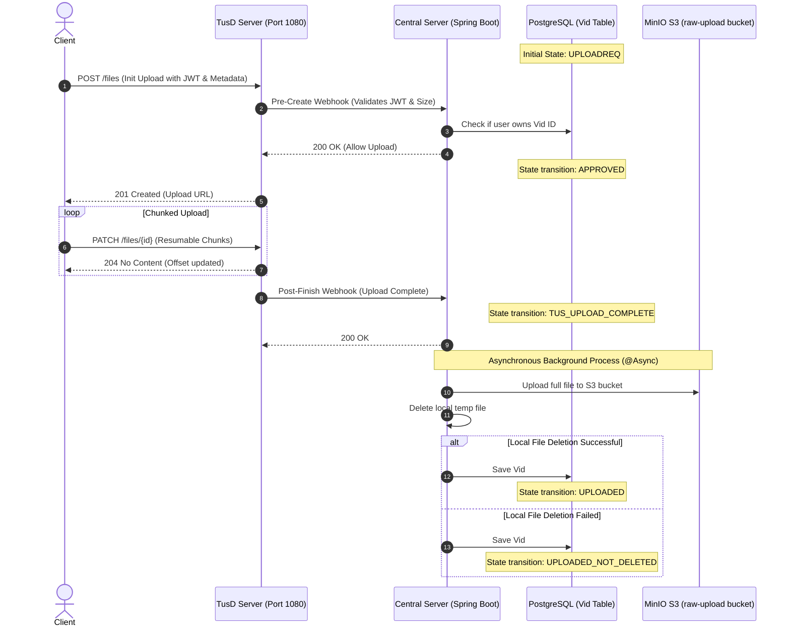
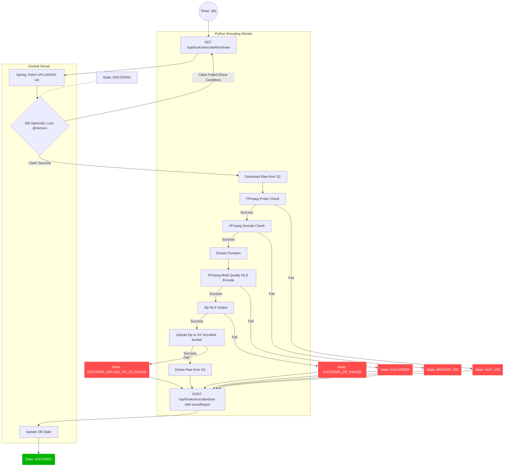
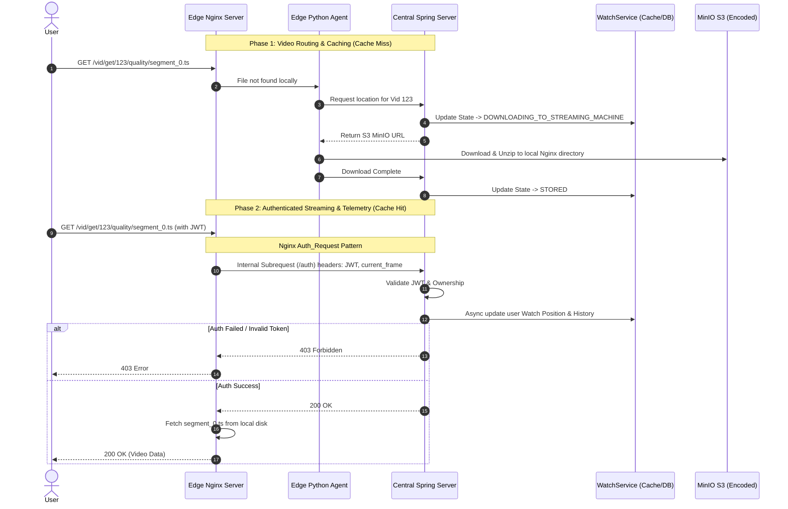

**Live Server URL:** [http://187.77.69.216/static/signup.html](http://187.77.69.216/static/signup.html)

**Note on Project Scope:** TRAID Stream is fundamentally a backend and distributed systems infrastructure project. While we have provided a minimalistic frontend to demonstrate the core user flows, we made the strategic decision to dedicate our time to solving the hardest technical challenges: distributed, asynchronous video encoding, and edge-node caching. 

**Infrastructure Verification (SSH Access):** We welcome deep technical reviews. Because the true complexity of this project is invisible from the browser (running across distributed Docker containers, and MinIO storage), we invite  you judges to inspect the live servers. Please reach out via Telegram (**@KalAxumawi**) and we will provide SSH keys so you can verify the distributed worker queues, Nginx routing, and system architecture in real-time.

# TRAID Stream: Distributed Video Processing & Edge Delivery Network

A custom-built, highly scalable, and cost-efficient distributed video streaming platform. Engineered from scratch to handle resumable uploads, asynchronous multi-node encoding, and secure edge-node delivery. Designed specifically for the Ethiopian market.

## The Engineering Philosophy: Slashing the Cost of Video Streaming

Video streaming at scale is notoriously expensive. Traditional platforms rely heavily on managed cloud services (such as AWS MediaConvert for encoding, CloudFront for CDN distribution, and managed Kubernetes for orchestration), which result in massive compute and bandwidth egress fees. 

This architecture was designed to make streaming radically cheaper by combining commodity VPS hardware with intelligent, custom-built software orchestrations. 

By decoupling the infrastructure into specialized, lightweight components, we achieve enterprise-level scaling at a fraction of the cost:
* **Commodity Compute for Encoding:** Video encoding is CPU-intensive. Instead of paying for managed encoding APIs, our distributed Python workers are designed to run on cheap, independent VPS nodes or spot instances. They poll the central server for jobs, self-throttle, and report back, requiring zero complex orchestrators.
* **Low-Cost Edge Delivery:** Instead of paying premium commercial CDN bandwidth rates, we engineered a custom Edge Delivery Network. Lightweight streaming nodes (Nginx + Python agents) download encoded assets directly from S3-compatible storage (MinIO) only upon user request. They cache the video segments locally, serving subsequent users via low-cost, localized VPS bandwidth.
* **Lean Infrastructure:** We deliberately avoided heavy external dependencies like Redis or Kafka. Asynchronous queues are handled via database-backed optimistic locking, and high-frequency read/writes (like watch-position telemetry) are managed entirely in-process using high-performance Caffeine caching.

---

## System Architecture & Data Flow

Our platform is divided into three distinct, decoupled pipelines.

### 1. The Resumable Upload Pipeline
Video uploads fail frequently due to network instability. To ensure a flawless creator experience without burdening the central API, we offloaded upload handling to a dedicated TusD server implementing the open protocol for resumable file uploads. The Spring Boot Central Server acts as the brain, using pre- and post-webhooks to authorize uploads via JWT, validate metadata, and asynchronously orchestrate the transfer of the raw file to MinIO S3 object storage.

### 2. Distributed Asynchronous Encoding Engine
We built a highly fault-tolerant encoding worker pool. Python-based worker nodes operate independently, polling the central Spring Boot API for tasks. 

Job safety is guaranteed via JPA Optimistic Locking (`@Version`). If two workers attempt to claim the same video simultaneously, the database rolls back the transaction for one, preventing duplicate encoding. The workers handle FFmpeg probing, decoding, duration extraction, and multi-quality HLS segmentation, uploading the final zipped output to S3. 

Failures are not binary. The workers report back using a 5-dimensional failure matrix, updating the database with granular states (e.g., `ENCODER_UPLOAD_TO_S3_FAILED` vs `BROKEN_VID`), allowing for precise automated retries and manual intervention.

---

### 3. Custom Edge CDN & Authenticated Streaming
To deliver video at scale securely, we implemented a custom, distributed streaming layer. 

When a user requests a video, they are routed to an edge node. If the node lacks the video, a local Python agent fetches and unzips the HLS payload from S3 on demand. 

Security and watch-tracking are handled via the Nginx `auth_request` pattern. Every request for a `.ts` video segment triggers an internal, sub-millisecond subrequest to the Central Spring Boot API. Spring validates the user's JWT, verifies authorization, and silently captures the exact frame the user is watching. To prevent database exhaustion, these telemetry updates are written to an asynchronous, in-memory Caffeine cache before being batched to PostgreSQL.

---

## Core Technical Highlights

* **Concurrency Control:** Utilizes database-level optimistic locking to manage distributed worker queues without requiring Kafka or RabbitMQ.
* **Deterministic State Machine:** The lifecycle of every video is strictly tracked across 15+ distinct states (from `UPLOADREQ` to `ENCODED` to specific localized failure modes).
* **Nginx Subrequest Authentication:** Secures static files at the Nginx layer while delegating business logic (JWT validation, watch progress) to the Java backend.
* **Idempotent Distributed Systems:** Worker node polling includes caching mechanisms to ensure idempotent retries in the event of network timeouts during job claiming.
* **In-Process Batching:** Transitioned database-heavy telemetry operations into asynchronous, non-blocking Caffeine cache operations to ensure the API handles high-throughput playback requests without latency spikes.

## Technology Stack

* **Central API & Orchestrator:** Java 21, Spring Boot 3, Spring Security, Spring Data JPA
* **Database & Caching:** PostgreSQL 15, Caffeine Cache (In-Memory)
* **Storage:** MinIO (S3-Compatible Object Storage), AWS SDK v2, Boto3
* **Edge Streaming Nodes:** Nginx, Python (FastAPI/Agent)
* **Encoding Workers:** Python, FFmpeg
* **Upload Protocol:** TusD (Go)
* **Infrastructure:** Docker, Docker Compose (Multi-VPS deployment strategy)

Our back end central server can be reached with this request. the front end is not that spectacualr becouse we spend days on teh back end and orchstrating container. and we hope our back end infstracture excuses the minimalstic front end we used
